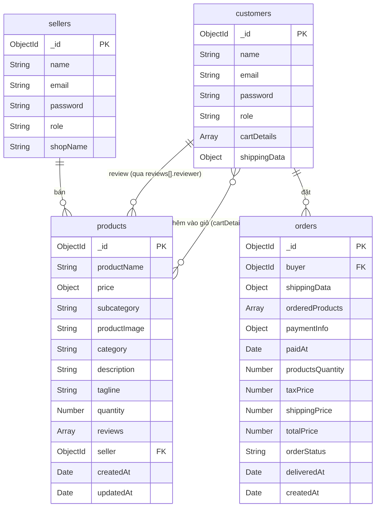

# Database Schema — MERN E-commerce ShopCart
**Mã dự án:** SHOPCART_2025
**Database:** MongoDB (via Mongoose ODM)
**Phiên bản:** 1.0.0
**Ngày cập nhật:** 2026-05-09

---

## Tổng quan

Hệ thống gồm **4 collections** chính:

| Collection | Mô tả |
|------------|--------|
| `customers` | Thông tin khách hàng + giỏ hàng |
| `sellers` | Thông tin người bán |
| `products` | Danh mục sản phẩm + reviews |
| `orders` | Đơn hàng đã đặt |

> **Lưu ý về quan hệ:** MongoDB không enforce foreign key constraints. Các quan hệ được thể hiện qua `ref` trong Mongoose schema và được giải quyết bằng `.populate()` khi truy vấn. Tính toàn vẹn dữ liệu phải được đảm bảo ở tầng ứng dụng (application layer).

---

## Collection 1: customers

**Tên collection:** `customers`
**Model Mongoose:** `Customer`

### Schema

| Field | Kiểu dữ liệu | Ràng buộc | Mô tả |
|-------|-------------|-----------|-------|
| `_id` | ObjectId | Auto-generated | Primary key |
| `name` | String | required | Họ và tên khách hàng |
| `email` | String | required, unique | Email đăng nhập |
| `password` | String | required | Mật khẩu đã hash bằng bcrypt |
| `role` | String | default: `"Customer"` | Vai trò trong hệ thống |
| `cartDetails` | Array | — | Danh sách sản phẩm trong giỏ hàng (embedded) |
| `shippingData` | Object | — | Thông tin giao hàng mặc định (embedded) |

### Embedded: cartDetails (Array of Object)

Mỗi phần tử trong `cartDetails` là một **bản sao thông tin sản phẩm** tại thời điểm thêm vào giỏ:

| Field | Kiểu dữ liệu | Mô tả |
|-------|-------------|-------|
| `productName` | String | Tên sản phẩm |
| `price.mrp` | Number | Giá niêm yết (Maximum Retail Price) |
| `price.cost` | Number | Giá bán thực tế |
| `price.discountPercent` | Number | Phần trăm giảm giá |
| `subcategory` | String | Danh mục con |
| `productImage` | String | URL hoặc base64 hình ảnh |
| `category` | String | Danh mục chính |
| `description` | String | Mô tả sản phẩm |
| `tagline` | String | Slogan / tagline |
| `quantity` | Number | Số lượng trong giỏ |
| `seller` | ObjectId | Ref tới `sellers._id` |

### Embedded: shippingData (Object)

| Field | Kiểu dữ liệu | Mô tả |
|-------|-------------|-------|
| `address` | String | Địa chỉ giao hàng |
| `city` | String | Thành phố |
| `state` | String | Tỉnh/Bang |
| `country` | String | Quốc gia |
| `pinCode` | Number | Mã bưu điện |
| `phoneNo` | Number | Số điện thoại |

### Ví dụ document

```json
{
  "_id": "64a1b2c3d4e5f6789012abcd",
  "name": "Nguyễn Văn A",
  "email": "nguyenvana@email.com",
  "password": "$2b$10$hashedpassword...",
  "role": "Customer",
  "cartDetails": [
    {
      "productName": "Áo thun nam",
      "price": { "mrp": 300000, "cost": 200000, "discountPercent": 10 },
      "subcategory": "Áo",
      "productImage": "https://res.cloudinary.com/...",
      "category": "Thời trang",
      "description": "Áo thun cotton 100%",
      "tagline": "Thoải mái mỗi ngày",
      "quantity": 2,
      "seller": "64a1b2c3d4e5f6789012ef01"
    }
  ],
  "shippingData": {
    "address": "123 Đường Lý Thường Kiệt",
    "city": "Hồ Chí Minh",
    "state": "Hồ Chí Minh",
    "country": "Vietnam",
    "pinCode": 700000,
    "phoneNo": 912345678
  }
}
```

---

## Collection 2: sellers

**Tên collection:** `sellers`
**Model Mongoose:** `Seller`

### Schema

| Field | Kiểu dữ liệu | Ràng buộc | Mô tả |
|-------|-------------|-----------|-------|
| `_id` | ObjectId | Auto-generated | Primary key |
| `name` | String | required | Họ và tên người bán |
| `email` | String | required, unique | Email đăng nhập |
| `password` | String | required | Mật khẩu đã hash bằng bcrypt |
| `role` | String | default: `"Seller"` | Vai trò trong hệ thống |
| `shopName` | String | required, unique | Tên cửa hàng (phải là duy nhất) |

### Ví dụ document

```json
{
  "_id": "64a1b2c3d4e5f6789012ef01",
  "name": "Trần Thị B",
  "email": "tranthib@shop.com",
  "password": "$2b$10$hashedpassword...",
  "role": "Seller",
  "shopName": "Shop Thời Trang B"
}
```

---

## Collection 3: products

**Tên collection:** `products`
**Model Mongoose:** `Product`
**Options:** `{ timestamps: true }` — tự động thêm `createdAt`, `updatedAt`

### Schema

| Field | Kiểu dữ liệu | Ràng buộc | Mô tả |
|-------|-------------|-----------|-------|
| `_id` | ObjectId | Auto-generated | Primary key |
| `productName` | String | — | Tên sản phẩm |
| `price.mrp` | Number | — | Giá niêm yết |
| `price.cost` | Number | — | Giá bán thực tế |
| `price.discountPercent` | Number | — | Phần trăm giảm giá |
| `subcategory` | String | — | Danh mục con |
| `productImage` | String | — | URL hoặc chuỗi base64 của hình ảnh |
| `category` | String | — | Danh mục chính |
| `description` | String | — | Mô tả chi tiết sản phẩm |
| `tagline` | String | — | Slogan / tagline ngắn |
| `quantity` | Number | default: `1` | Số lượng tồn kho |
| `reviews` | Array | — | Danh sách đánh giá (embedded) |
| `seller` | ObjectId | ref: `"sellers"` | Ref tới người bán |
| `createdAt` | Date | auto (timestamps) | Thời điểm tạo |
| `updatedAt` | Date | auto (timestamps) | Thời điểm cập nhật cuối |

### Embedded: reviews (Array of Object)

| Field | Kiểu dữ liệu | Ràng buộc | Mô tả |
|-------|-------------|-----------|-------|
| `_id` | ObjectId | Auto-generated | ID của review |
| `rating` | Number | — | Điểm đánh giá (thường 1-5) |
| `comment` | String | — | Nội dung nhận xét |
| `reviewer` | ObjectId | ref: `"customers"` | Ref tới khách hàng đánh giá |
| `date` | Date | default: `Date.now` | Thời điểm đánh giá |

### Ví dụ document

```json
{
  "_id": "64a1b2c3d4e5f678901234ab",
  "productName": "Áo thun nam cổ tròn",
  "price": { "mrp": 300000, "cost": 200000, "discountPercent": 10 },
  "subcategory": "Áo",
  "productImage": "https://res.cloudinary.com/sample/image.jpg",
  "category": "Thời trang",
  "description": "Áo thun nam chất liệu cotton 100%, thoáng mát",
  "tagline": "Thoải mái mỗi ngày",
  "quantity": 50,
  "reviews": [
    {
      "_id": "64a1b2c3d4e5f678901234cd",
      "rating": 5,
      "comment": "Chất lượng rất tốt, giao hàng nhanh",
      "reviewer": "64a1b2c3d4e5f6789012abcd",
      "date": "2026-05-09T08:00:00.000Z"
    }
  ],
  "seller": "64a1b2c3d4e5f6789012ef01",
  "createdAt": "2026-04-01T00:00:00.000Z",
  "updatedAt": "2026-05-09T08:00:00.000Z"
}
```

---

## Collection 4: orders

**Tên collection:** `orders`
**Model Mongoose:** `Order`

> **Thiết kế quan trọng:** `orderedProducts` lưu **snapshot** (bản sao) của sản phẩm tại thời điểm mua hàng — **không dùng ref** tới `products`. Điều này đảm bảo lịch sử đơn hàng không bị ảnh hưởng khi sản phẩm bị sửa đổi hoặc xóa về sau.

### Schema

| Field | Kiểu dữ liệu | Ràng buộc | Mô tả |
|-------|-------------|-----------|-------|
| `_id` | ObjectId | Auto-generated | Primary key |
| `buyer` | ObjectId | required, ref: `"customers"` | Ref tới khách hàng đặt hàng |
| `shippingData` | Object | required | Thông tin giao hàng (embedded) |
| `orderedProducts` | Array | — | Danh sách snapshot sản phẩm (embedded) |
| `paymentInfo.id` | String | required | ID giao dịch thanh toán |
| `paymentInfo.status` | String | required | Trạng thái thanh toán (vd: `"paid"`) |
| `paidAt` | Date | required | Thời điểm thanh toán thành công |
| `productsQuantity` | Number | required, default: `0` | Tổng số lượng sản phẩm |
| `taxPrice` | Number | required, default: `0` | Thuế |
| `shippingPrice` | Number | required, default: `0` | Phí vận chuyển |
| `totalPrice` | Number | required, default: `0` | Tổng giá trị đơn hàng |
| `orderStatus` | String | required, default: `"Processing"` | Trạng thái đơn hàng |
| `deliveredAt` | Date | optional | Thời điểm giao hàng thành công |
| `createdAt` | Date | default: `Date.now` | Thời điểm tạo đơn hàng |

### Embedded: shippingData (Object)

| Field | Kiểu dữ liệu | Ràng buộc | Mô tả |
|-------|-------------|-----------|-------|
| `address` | String | required | Địa chỉ giao hàng |
| `city` | String | required | Thành phố |
| `state` | String | required | Tỉnh/Bang |
| `country` | String | required | Quốc gia |
| `pinCode` | Number | required | Mã bưu điện |
| `phoneNo` | Number | required | Số điện thoại liên hệ |

### Embedded: orderedProducts (Array — Product Snapshot)

Mỗi phần tử là **bản snapshot** của sản phẩm tại thời điểm mua, **không thay đổi** kể cả khi product gốc bị sửa/xóa:

| Field | Kiểu dữ liệu | Mô tả |
|-------|-------------|-------|
| `productName` | String | Tên sản phẩm lúc mua |
| `price.mrp` | Number | Giá niêm yết lúc mua |
| `price.cost` | Number | Giá thực tế lúc mua |
| `price.discountPercent` | Number | % giảm giá lúc mua |
| `category` | String | Danh mục |
| `subcategory` | String | Danh mục con |
| `productImage` | String | Hình ảnh |
| `quantity` | Number | Số lượng đặt |
| `seller` | ObjectId | ID người bán (giữ để tra cứu) |

### Ví dụ document

```json
{
  "_id": "64a1b2c3d4e5f67890ab1234",
  "buyer": "64a1b2c3d4e5f6789012abcd",
  "shippingData": {
    "address": "123 Đường Lý Thường Kiệt",
    "city": "Hồ Chí Minh",
    "state": "Hồ Chí Minh",
    "country": "Vietnam",
    "pinCode": 700000,
    "phoneNo": 912345678
  },
  "orderedProducts": [
    {
      "productName": "Áo thun nam cổ tròn",
      "price": { "mrp": 300000, "cost": 200000, "discountPercent": 10 },
      "category": "Thời trang",
      "subcategory": "Áo",
      "productImage": "https://res.cloudinary.com/sample/image.jpg",
      "quantity": 2,
      "seller": "64a1b2c3d4e5f6789012ef01"
    }
  ],
  "paymentInfo": {
    "id": "pay_3NkL8j2eZvKYlo2C...",
    "status": "paid"
  },
  "paidAt": "2026-05-09T10:30:00.000Z",
  "productsQuantity": 2,
  "taxPrice": 0,
  "shippingPrice": 0,
  "totalPrice": 400000,
  "orderStatus": "Processing",
  "deliveredAt": null,
  "createdAt": "2026-05-09T10:30:00.000Z"
}
```

---

## Sơ đồ quan hệ (Entity Relationship)

### Dạng text/ASCII

```
┌─────────────────────────────────────────────────────────────────────┐
│                     SHOPCART_2025 — DB Relations                     │
└─────────────────────────────────────────────────────────────────────┘

  ┌──────────────┐          ┌──────────────────┐
  │   sellers    │          │    products      │
  │──────────────│          │──────────────────│
  │ _id (PK)     │◄─────────│ seller (ref)     │
  │ name         │  1 : N   │ _id (PK)         │
  │ email        │          │ productName      │
  │ password     │          │ price            │
  │ role         │          │ category         │
  │ shopName     │          │ subcategory      │
  └──────────────┘          │ quantity         │
                            │ reviews[]        │
                            │  └ reviewer(ref)─┼──────────┐
                            └──────────────────┘          │
                                                          │
  ┌──────────────────────────────────────────┐            │
  │               customers                 │◄───────────┘
  │──────────────────────────────────────────│
  │ _id (PK)                                 │
  │ name                                     │
  │ email                                    │
  │ password                                 │
  │ role                                     │
  │ cartDetails[] (embedded product copy)    │
  │  └ seller (ref) ─────────────────────────┼──► sellers
  │ shippingData (embedded)                  │
  └──────────────────────────────────────────┘
             │
             │ 1 : N
             ▼
  ┌──────────────────────────────────────────┐
  │                 orders                   │
  │──────────────────────────────────────────│
  │ _id (PK)                                 │
  │ buyer (ref) ─────────────────────────────┼──► customers
  │ shippingData (embedded)                  │
  │ orderedProducts[] (SNAPSHOT — no ref)    │
  │  └ seller (ObjectId — lưu để tra cứu)   │
  │ paymentInfo (embedded)                   │
  │ orderStatus                              │
  │ totalPrice                               │
  └──────────────────────────────────────────┘
```

### Dạng Mermaid ERD



---

## Ghi chú thiết kế

### 1. Embedded vs Reference
- `cartDetails` trong `customers` — embedded vì cần thay đổi linh hoạt (thêm/xóa/sửa số lượng)
- `orderedProducts` trong `orders` — embedded (snapshot) để bảo toàn lịch sử đơn hàng
- `reviews` trong `products` — embedded để truy vấn nhanh; `reviewer` dùng ref để populate tên

### 2. Tính toàn vẹn dữ liệu (Data Integrity)
MongoDB không tự động cascade delete hay enforce FK. Các thao tác sau phải xử lý ở application layer:
- Khi xóa product (`DELETE /DeleteProduct/:id`) → phải xóa khỏi `cartDetails` của tất cả customers
- Khi xóa tất cả products của seller (`DELETE /DeleteProducts/:id`) → phải dọn sạch cartDetails
- Khi xóa seller → cần xóa toàn bộ products liên quan (chưa implement)

### 3. Password Security
- Mật khẩu được hash bằng **bcrypt** trước khi lưu
- Không bao giờ trả về field `password` trong response API

### 4. orderedProducts — Snapshot Pattern
Khi đặt hàng, toàn bộ thông tin sản phẩm được **sao chép** vào `orderedProducts`. Điều này có nghĩa:
- Lịch sử đơn hàng luôn chính xác dù sản phẩm bị sửa giá sau đó
- Field `seller` trong snapshot vẫn là ObjectId để hỗ trợ truy vấn `/getOrderedProductsBySeller/:id`
- Không dùng `.populate()` cho `orderedProducts`

### 5. Indexes đề xuất
```javascript
// customers
customers.createIndex({ email: 1 }, { unique: true })

// sellers
sellers.createIndex({ email: 1 }, { unique: true })
sellers.createIndex({ shopName: 1 }, { unique: true })

// products
products.createIndex({ seller: 1 })
products.createIndex({ category: 1 })
products.createIndex({ subcategory: 1 })
products.createIndex({ productName: "text", category: "text", subcategory: "text" })

// orders
orders.createIndex({ buyer: 1 })
```

---

*Tài liệu được tạo tự động cho dự án SHOPCART_2025 — Ngày 2026-05-09*
